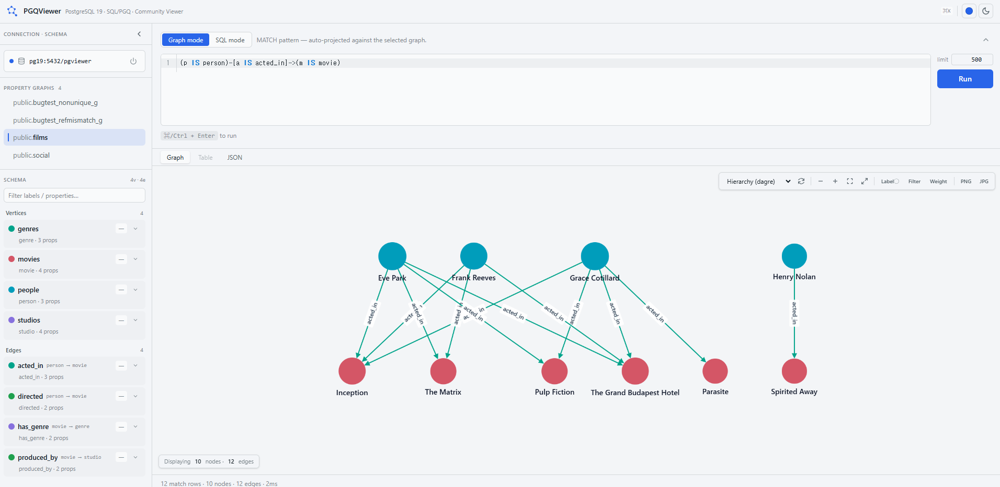

# PGQViewer

A community graph viewer for **PostgreSQL 19**'s native property graphs (SQL/PGQ, ISO/IEC 9075-16:2023).

Connect to your PostgreSQL 19 database, pick a property graph from the sidebar, type a `MATCH` pattern, and explore the result on an interactive canvas — no extensions, no separate graph database, no ETL.



PGQViewer focuses on doing one thing well: **viewing**. There's no graph designer, notebook, privileges UI, or schema diff — read the graph, draw the graph, export the graph.

> **Status: alpha, under active development.** Tested against the official **PostgreSQL 19 Beta 1** release (June 2026). PG19 GA is expected around September/October 2026; catalog and error-message details may still shift between betas, and we track them release by release. Issues and contributions are very welcome — see [Contributing](#contributing).

---

## Quick start

PGQViewer runs as a single Docker container (UI and API together):

```bash
git clone https://github.com/aoncodev/PGQViewer.git
cd PGQViewer
docker build -t pgqviewer .
docker run --rm -p 127.0.0.1:8080:8080 -v pgqviewer-data:/data pgqviewer
```

Open <http://localhost:8080> and fill in the connection form with your PostgreSQL 19 server.

**You bring the database.** PGQViewer does not ship a demo database — it connects to any PostgreSQL 19 (Beta 1 or newer) instance that has at least one `CREATE PROPERTY GRAPH` defined. If you don't have one yet, the official `postgres:19beta1` image plus the [two-minute sample graph](#no-graph-yet-a-two-minute-sample) below gets you exploring immediately.

**Networking notes**

- Your database must be reachable *from inside the container*. For a PostgreSQL running on the same machine, use host `host.docker.internal` in the connection form (on Linux, add `--add-host=host.docker.internal:host-gateway` to the `docker run` command).
- The `-v pgqviewer-data:/data` volume persists your saved connections between runs.
- ⚠️ The endpoint is unauthenticated and opens outbound database connections for whoever reaches it. Publish the port on loopback (as above) or a trusted network only.

### No graph yet? A two-minute sample

Run this against any PG19 database (for example `docker run -d -p 5432:5432 -e POSTGRES_PASSWORD=postgres postgres:19beta1`, then `psql`):

```sql
CREATE TABLE people (
    id   int PRIMARY KEY,
    name text NOT NULL,
    born int
);

CREATE TABLE knows (
    src   int NOT NULL REFERENCES people (id),
    dst   int NOT NULL REFERENCES people (id),
    since int,
    PRIMARY KEY (src, dst)
);

INSERT INTO people VALUES (1,'Alice',1985), (2,'Bob',1990), (3,'Carol',1988), (4,'Dave',1992);
INSERT INTO knows  VALUES (1,2,2010), (2,3,2012), (3,4,2015), (1,4,2020);

CREATE PROPERTY GRAPH social
    VERTEX TABLES (
        people LABEL person PROPERTIES ALL COLUMNS
    )
    EDGE TABLES (
        knows
            SOURCE      KEY (src) REFERENCES people (id)
            DESTINATION KEY (dst) REFERENCES people (id)
            LABEL knows PROPERTIES ALL COLUMNS
    );
```

Connect with PGQViewer, select `public.social`, and run:

```
(a IS person)-[k IS knows]->(b IS person)
```

---

## What it does

- 📈 **Renders property graphs as graphs.** Stable per-label colors, degree-based node sizing, parallel-edge fanning, directed arrows that always follow the edge's true `SOURCE → DESTINATION` direction.
- 🧬 **Two editor modes.** *Graph mode* takes just a `MATCH` pattern and auto-projects every key and property column needed to reconstruct vertex/edge identity client-side — PGQViewer's substitute for the `ELEMENT_ID()` function PG19 doesn't ship yet. *SQL mode* runs verbatim PostgreSQL — joins, CTEs, `EXPLAIN`, anything you can type — with results in a sortable, filterable table.
- 🖱️ **Expand-on-click.** Hover or double-click a vertex to pull in its 1-hop neighbourhood; new nodes are laid out around the anchor without disturbing what you've already arranged, and everything dedups on stable ids.
- 🧭 **Fourteen layouts.** Force-directed (`fcose`, `cola`, `cose`, `cose-bilkent`, `euler`), hierarchical (`dagre`, `klay` — the screenshot above), `concentric`, `breadth-first`, `circle`, `grid`, `avsdf`, `spread`, `random`. Heavy layouts automatically swap to fast equivalents on large results so the UI never freezes.
- ⚡ **Streaming results.** The server emits NDJSON and the canvas fills in as rows arrive; queries are cancellable mid-flight (`pg_cancel_backend` under the hood).
- 🔍 **Schema sidebar.** Every vertex/edge element with labels, typed property chips, endpoint directions, and approximate row counts; click an element to drop a ready-to-edit `MATCH` snippet into the editor. Filtering the sidebar also dims non-matching elements on the canvas.
- 🛡️ **Honest about your catalog.** PG19 legally accepts graph definitions that break identity assumptions (non-unique keys, edge `REFERENCES` that don't match the vertex key). PGQViewer detects both at connect time and tells you exactly what to fix instead of silently drawing a wrong graph. Truncated results and undrawable edges are labelled, never hidden.
- 💡 **Actionable error hints.** PG19's SQL/PGQ error messages are mapped to plain-language explanations with links to the relevant PostgreSQL docs — each pattern verified verbatim against Beta 1.
- 🗂️ **Schema-aware autocomplete.** CodeMirror 6 with SQL/PGQ keywords plus live label/property completions from the connected graph's metadata, and per-mode query history (Ctrl/Cmd-↑↓).
- 🎨 **Make it yours.** Per-label colors and captions (choose which property is shown on each node), edge thickness mapped to a numeric property, property-based filtering, light/dark themes with nine accent palettes, focus mode.
- 📤 **Exports.** PNG/JPG from the canvas; GraphML, Cypher (`MERGE` statements), JSON from graph results; CSV/JSON from table results.
- 💾 **Saved connections.** Profiles persist in the container volume; reconnect with one click.

---

## How it works

```
┌──────────────────────────────────────────────┐
│        pgqviewer (one container)              │
│                                              │
│   ┌────────────────┐   ┌───────────────────┐ │
│   │ web UI (React  │   │ Go API            │ │
│   │ + Cytoscape)   │   │ NDJSON streaming  │ │
│   └───────┬────────┘   └─────────┬─────────┘ │
└───────────┼──────────────────────┼───────────┘
            │ browser ◀── HTTP ──▶ │
                                   ▼  TCP/TLS
                   ┌────────────────────────────┐
                   │  your PostgreSQL 19        │
                   │  (SQL/PGQ property graphs) │
                   └────────────────────────────┘
```

Graph mode generates a standard `SELECT … FROM GRAPH_TABLE (…)` statement: PGQViewer introspects the `pg_propgraph_*` catalogs, builds the `COLUMNS` clause itself (every key and declared property for each pattern variable), and reassembles rows into deduplicated vertices and edges with synthesized stable ids. Nothing is cached or copied — every query runs live against your database, and graph mode only ever issues `SELECT`s.

---

## Property graph requirements

SQL/PGQ only lets a query project **declared properties**. Since PGQViewer reconstructs vertex/edge identity from primary-key and foreign-key columns, those columns must be exposed as properties on their elements. The easiest way is `PROPERTIES ALL COLUMNS` (as in the sample above); an explicit list works too, as long as it includes the key columns:

```sql
LABEL knows PROPERTIES (src, dst, since)
```

If a graph doesn't satisfy this — or carries a riskier shape like a non-unique `KEY` — PGQViewer explains exactly what's missing and how to fix it when you select the graph.

---

## Limitations (inherited from PG19 SQL/PGQ)

- **No variable-length paths.** `[*]`, `[*1..3]`, `+` quantifiers error in PG19; use recursive CTEs in SQL mode for transitive traversal.
- **One path pattern per `GRAPH_TABLE`.** No comma-separated paths inside a single `MATCH`.
- **No `ELEMENT_ID()`.** PGQViewer synthesizes stable ids from element + key values instead.
- **No `a.*` in `COLUMNS`.** Graph mode enumerates every declared property automatically so you never write `COLUMNS` by hand.

---

## Contributing

PGQViewer is in **active development** and contributions of every size are welcome — bug reports against new PG19 betas are especially valuable while the feature stabilises upstream.

- **Found a graph that renders wrong?** Please open an issue with the `CREATE PROPERTY GRAPH` statement and the query — correctness reports get priority.
- **Code:** the backend is Go (chi + pgx), the frontend React + TypeScript + Cytoscape.js. `pnpm install && pnpm dev` starts a hot-reloading dev stack; `pnpm test:server` and `pnpm --filter @pgqviewer/renderer test` run the suites.
- **Ideas / discussion:** open an issue — roadmap topics include encrypted credential storage, an authentication layer for shared deployments, and a recursive-CTE helper for variable-length paths.

---

## Background

SQL/PGQ ([ISO/IEC 9075-16:2023](https://www.iso.org/standard/76120.html)) brings property graph queries into the SQL standard. PostgreSQL 19 is the first major open-source SQL database to implement it natively — graphs are defined as metadata over existing relational tables (no migration), and graph patterns rewrite into ordinary joins on the underlying rows.

More on the feature itself:

- [PostgreSQL 19 documentation — Property Graphs](https://www.postgresql.org/docs/19/ddl-property-graphs.html)
- [PostgreSQL 19 documentation — Graph Queries](https://www.postgresql.org/docs/19/queries-graph.html)
- [Representing graphs in PostgreSQL with SQL/PGQ — EDB](https://www.enterprisedb.com/blog/representing-graphs-postgresql-sqlpgq)

---

## License

[Apache License 2.0](LICENSE) — Copyright 2026 Akhidjon Abdullaev. See [`NOTICE`](NOTICE) for attribution terms.
